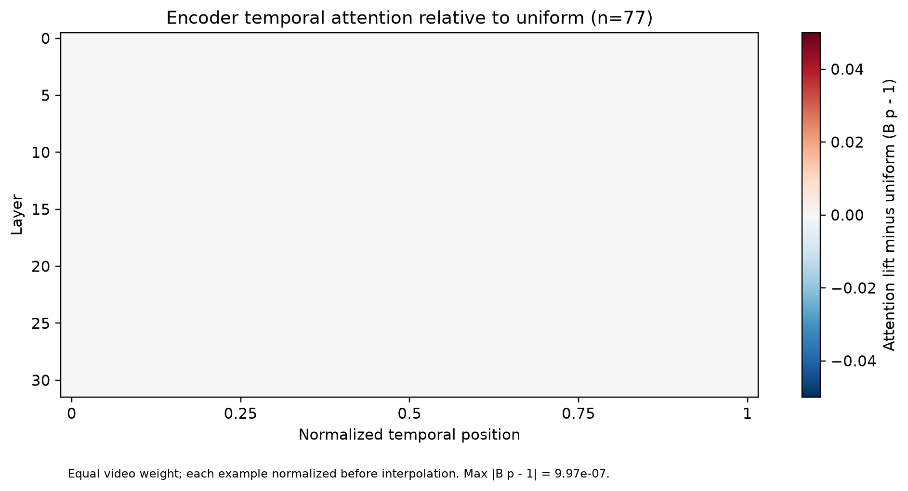
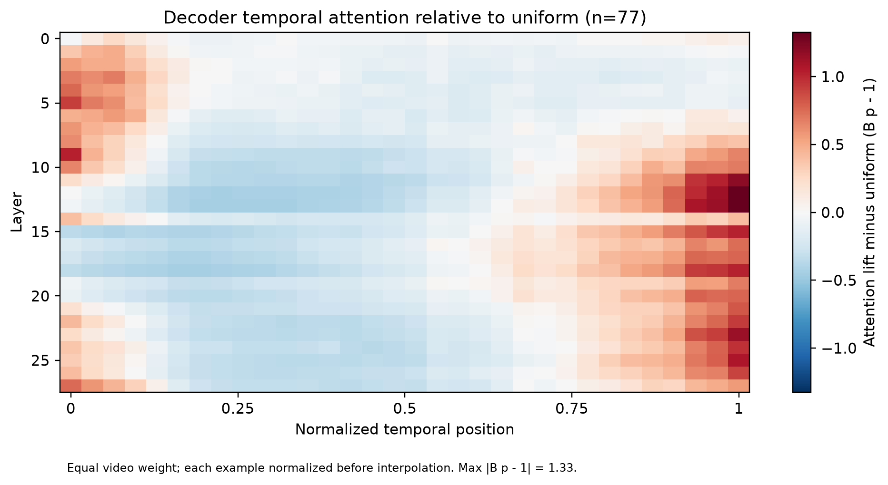
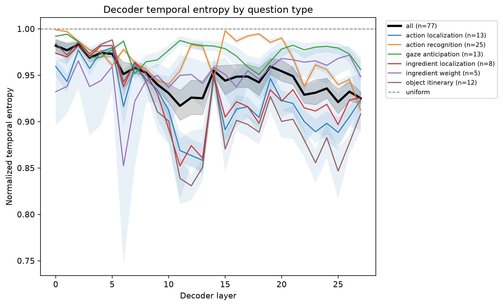
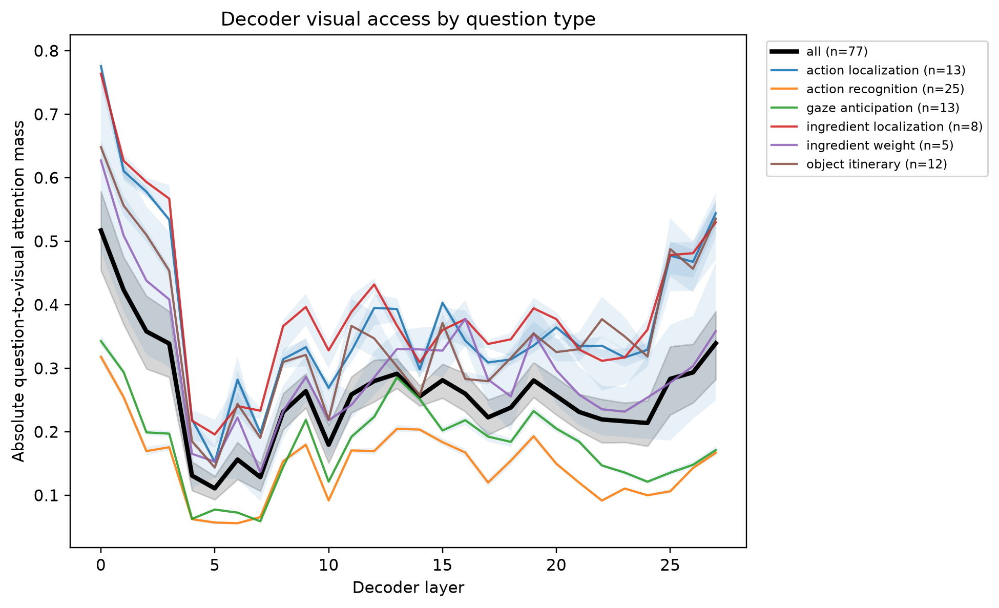
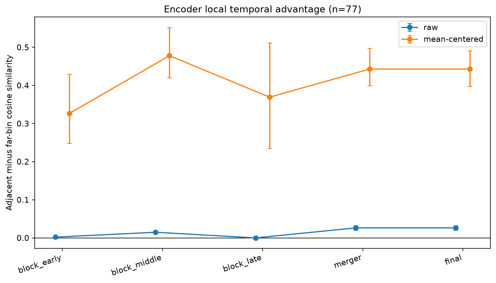

# Experiment 1 v3: Preliminary Temporal Baseline

## Research question

This experiment asks whether Qwen2.5-VL processes different temporal regions of a video differently across its vision encoder and language decoder, and whether the resulting temporal allocation could eventually support adaptive temporal computation.

The two stages measure different phenomena:

- Vision-encoder attention and representations are query-agnostic because the encoder has not seen the question.
- Decoder attention from question-token rows to visual-token columns is query-conditioned.

Attention is treated as a descriptive signal, not as proof of importance. Query specificity, positional bias, and causal utility require additional controls and interventions.

## Baseline configuration

- Model: Qwen2.5-VL-7B
- Independent experimental units: 77 source videos
- Primary questions: one per source video
- Resolution: medium
- Sampling: adaptive full-video temporal sampling
- Temporal bins: 8–64 per video
- Frames per bin: 2 chronological frames
- Frame budget: 16–128 frames
- Vision blocks: 32
- Decoder layers: 28
- Decoder query scope: question tokens only
- Attention extraction: reduced SDPA
- Aggregation: equal weight per source video

All 77 examples completed successfully. Structural validation confirmed:

- 77 artifacts from 77 unique source videos;
- 8–64 temporal bins per example;
- 32 encoder-attention layers and 28 decoder-attention layers;
- finite values and correctly normalized temporal distributions;
- valid monotonic timestamps and full-video temporal coverage.

## Baseline VQA performance

| Category | Correct | Total | Accuracy |
|---|---:|---:|---:|
| Fine-grained | 24 | 39 | 61.54% |
| Gaze | 5 | 13 | 38.46% |
| Ingredient | 6 | 13 | 46.15% |
| Object motion | 2 | 12 | 16.67% |
| **Overall** | **37** | **77** | **48.05%** |

The accuracy table establishes that the sampled inputs retain meaningful task signal. Category differences are descriptive because category, question type, and duration are not independently balanced.

## Duration-normalized attention aggregation

Videos contain different numbers of temporal bins, so raw bin probabilities cannot be averaged directly. For each example with \(B\) bins and normalized temporal mass \(p_b\), the corrected analysis computes

\[
\operatorname{lift}_b = Bp_b.
\]

Uniform temporal allocation therefore has lift 1 for every example, regardless of whether it contains 8 or 64 bins. Each lift distribution is interpolated at normalized relative-time bin centers and only then averaged across videos. Heatmaps display \(Bp_b-1\), for which zero denotes uniform attention.

## Encoder attention is uniform in aggregate

Across all 77 videos, 32 encoder blocks, heads, and normalized temporal positions, the maximum absolute deviation of mean incoming temporal-attention lift from uniform is

\[
\max |Bp_b-1| = 9.97\times 10^{-7}.
\]

This is numerical noise. The earlier autoscaled encoder heatmap visually exaggerated these microscopic differences.

The result establishes that **mean incoming encoder-attention mass does not provide a useful aggregate temporal ranking signal**. It does not establish that encoder representations lack temporal information, nor does it rule out per-example or per-head selectivity that cancels under aggregation.

## Decoder attention becomes strongly nonuniform

The decoder exhibits substantial depth-dependent temporal allocation. Its maximum mean deviation from uniform is 1.3266 lift units, corresponding to a maximum mean lift of approximately

\[
1 + 1.3266 = 2.3266.
\]

Thus, the most emphasized normalized temporal position receives approximately **2.33 times its uniform expected attention mass** after averaging across videos.

The heatmap shows two broad regimes:

- early decoder layers preferentially allocate attention to the beginning of the video;
- middle and later layers increasingly emphasize the end of the video;
- layers 11–15 form a conspicuous redistribution region;
- late layers again exhibit strong boundary-focused allocation.

This is evidence of nonuniform decoder temporal allocation. The boundary-shaped pattern may reflect positional bias rather than content relevance, so it cannot yet justify temporal pruning.

## Temporal concentration changes non-monotonically with depth

Normalized entropy remains high overall, meaning decoder attention is generally broad rather than concentrated in a single bin. Nevertheless, its concentration changes substantially and non-monotonically across layers.

- Peak mean top-bin mass occurs at decoder layer 27: 0.1908.
- Lowest overall mean normalized entropy occurs at decoder layer 11: 0.9170.
- Localization and object-itinerary questions show stronger middle- and late-layer concentration than gaze and action-recognition questions.
- Question-type curves remain descriptive because question type is entangled with absolute video duration and temporal-bin count.

### Layer-14 redistribution

Mean and median statistics show that the layer-14 behavior is systematic rather than an artifact of a few outliers.

| Question type | Layer 13 entropy | Layer 14 entropy | Layer 15 entropy |
|---|---:|---:|---:|
| Action localization | 0.858 | 0.947 | 0.891 |
| Ingredient localization | 0.861 | 0.950 | 0.905 |
| Object itinerary | 0.851 | 0.952 | 0.871 |
| Action recognition | 0.981 | 0.948 | 0.998 |
| Gaze anticipation | 0.982 | 0.981 | 0.979 |

Localization and itinerary tasks become markedly more diffuse at layer 14 before concentrating again. Action recognition instead becomes slightly more concentrated at layer 14 and almost uniform at layer 15. This indicates a systematic layer-dependent redistribution rather than monotonic temporal focusing.

## Absolute visual access is distinct from temporal allocation

Absolute question-to-visual attention mass varies strongly with both layer and question type.

- Action and ingredient localization exhibit the strongest early visual access.
- Action recognition and gaze anticipation allocate substantially less absolute mass to vision.
- Visual access falls sharply in early layers, partially recovers through the middle, and rises again in the final layers.
- Layers can change their conditional temporal distribution even while total visual access decreases.

Consequently, absolute visual-attention mass and the temporal distribution conditioned on visual access must remain separate measurements.

## Encoder representations retain local temporal structure

Although aggregate encoder-attention mass is uniform, encoder representations are locally structured. Adjacent-bin representations are more similar than far-bin representations at every captured stage.

| Encoder stage | Raw adjacent-minus-far | Mean-centered adjacent-minus-far |
|---|---:|---:|
| Early block | 0.0021 [0.0012, 0.0031] | 0.327 [0.248, 0.429] |
| Middle block | 0.0148 [0.0114, 0.0188] | 0.478 [0.420, 0.552] |
| Late block | 0.000014 [0.000011, 0.000018] | 0.369 [0.235, 0.512] |
| Merger | 0.0263 [0.0202, 0.0322] | 0.443 [0.399, 0.497] |
| Final | 0.0263 [0.0202, 0.0324] | 0.443 [0.397, 0.491] |

Values in brackets are hierarchical participant-then-video bootstrap 95% confidence intervals.

Raw representations share an overwhelmingly strong common direction, making all temporal bins appear extremely similar. Removing the per-video mean direction exposes a large and consistently positive local temporal advantage. This supports the presence of high temporal redundancy together with residual local temporal organization.

The merger and final values are identical because canonical token reordering does not change pairwise cosine relationships; they are not independent effects. Representation similarity was captured at five encoder stages, whereas attention mass was captured at all 32 blocks.

## Duration and question-type confounding

The global duration groups contain 26 short, 25 medium, and 26 long videos, but their task composition is highly imbalanced:

- 25 of 26 short examples are fine-grained action recognition;
- all gaze-anticipation examples occur in the medium group;
- long examples consist of action localization, ingredient localization, and object-motion itinerary tasks.

Accordingly, pooled short/medium/long accuracy or attention differences cannot be interpreted as causal duration effects. Duration must be treated as a control variable through within-question-type analysis, continuous log-duration adjustment, and—most importantly—paired within-example interventions.

## Current interpretation

The corrected baseline supports three descriptive conclusions:

1. Mean incoming temporal-attention mass in the query-agnostic vision encoder is effectively uniform.
2. Encoder representations nevertheless contain substantial local temporal structure after removing their dominant shared component.
3. Strong, non-monotonic temporal allocation emerges in the query-conditioned decoder, reaching approximately 2.33 times uniform expectation at its most emphasized averaged position.

The baseline does **not** yet show that decoder-selected bins are query-relevant, content-driven, causally important, or safely prunable.

## Required follow-up experiments

1. **Repeated-frame control:** preserve temporal positions while removing content differences to measure pure positional bias.
2. **Reversed-video control:** determine whether allocation follows content or absolute early/late positions.
3. **Mismatched-query control:** measure whether temporal rankings change with the question.
4. **Necessity interventions:** mask top, bottom, and position-matched random temporal bins.
5. **Sufficiency interventions:** retain only query-ranked top bins versus matched random or uniform selections.
6. **Fusion-depth blocking:** determine when direct access to selected visual evidence stops affecting predictions.
7. **Fixed-budget robustness:** repeat the principal findings using 128 uniform frames and 16 relative-time bins.
8. **Clustered statistical analysis:** treat source video as the independent unit and cluster resampling by participant and video.

Only these paired controls and interventions can establish whether the observed decoder allocation is useful for temporal optimization.