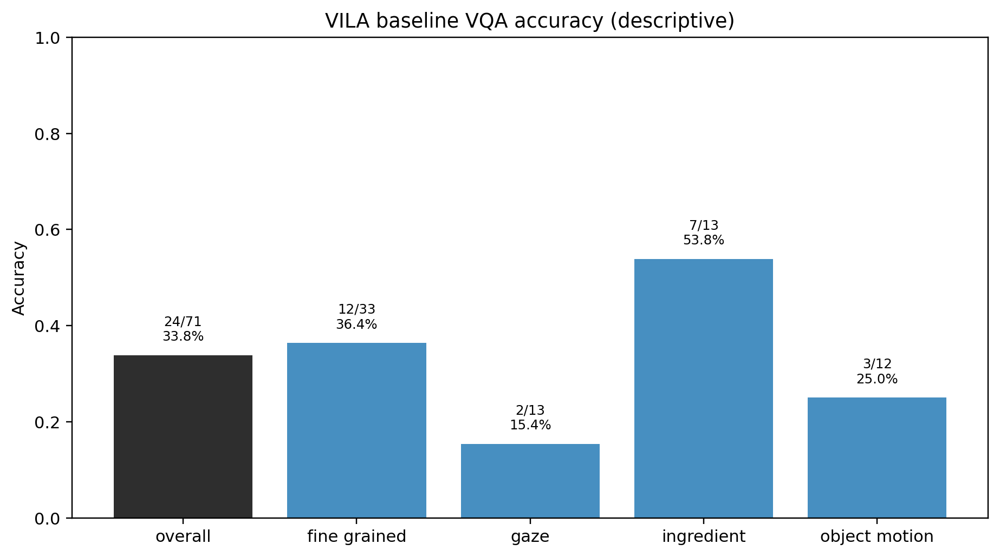
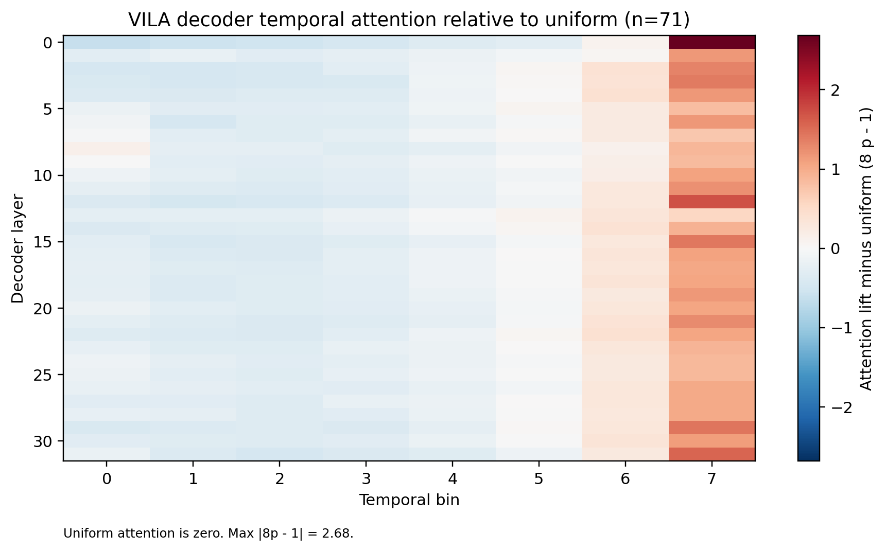
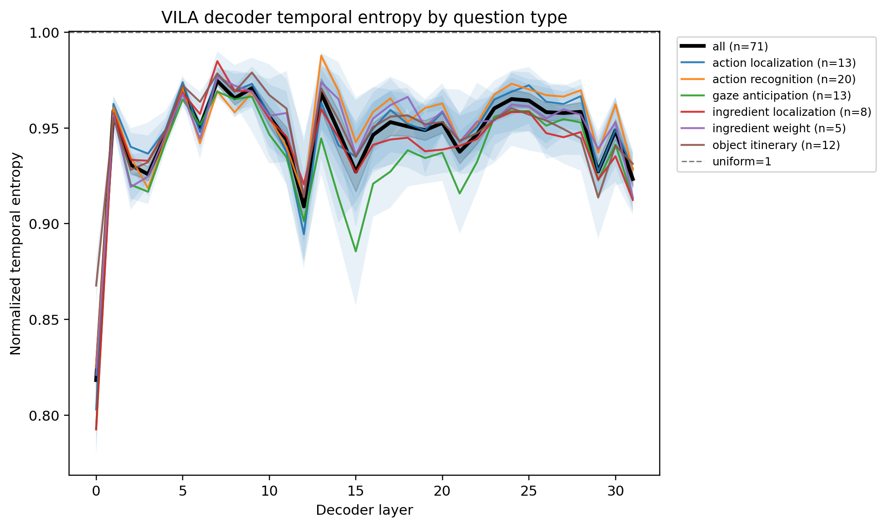
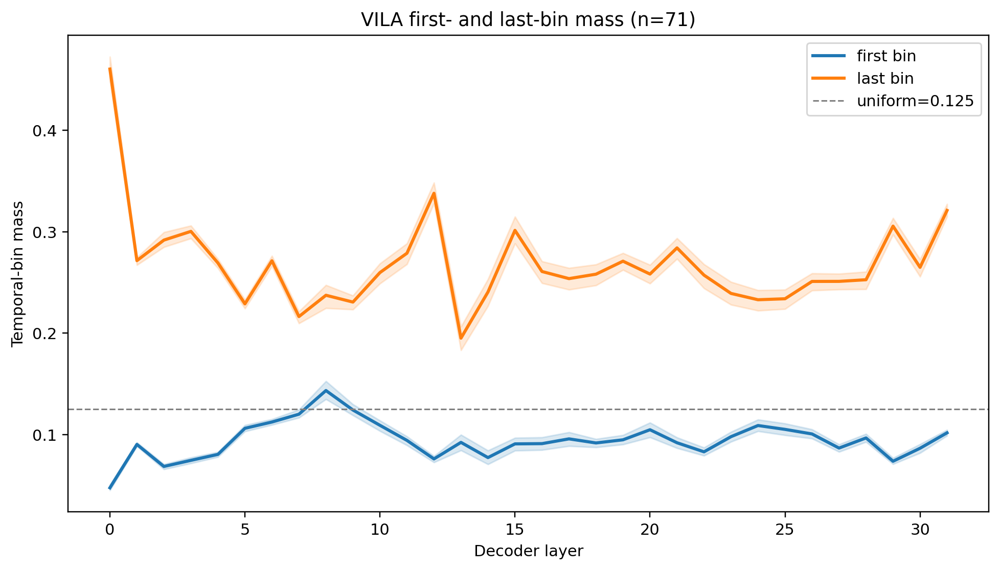
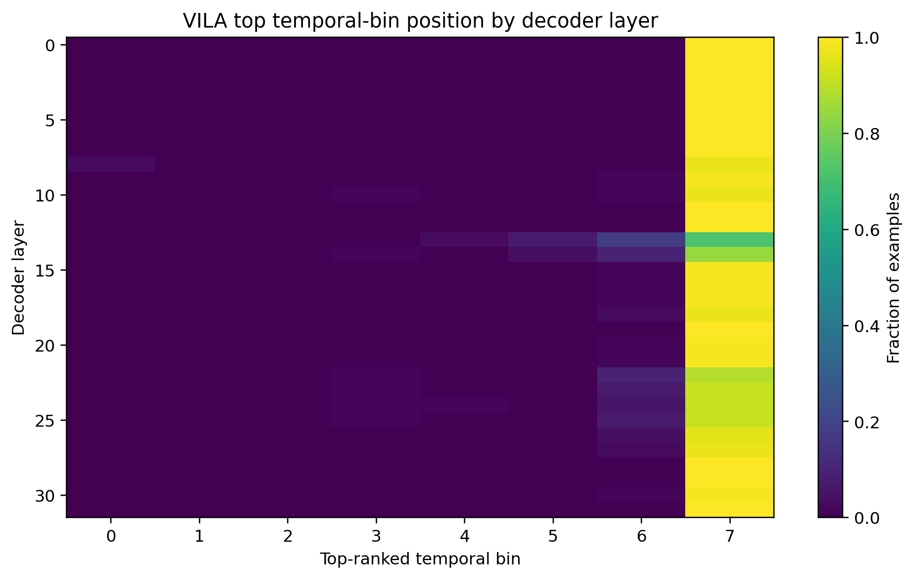
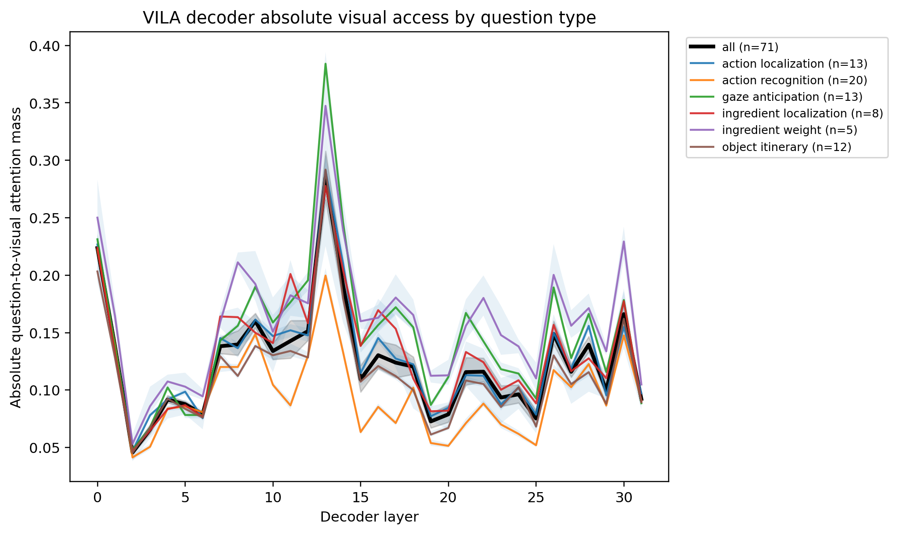

# Experiment 1 v3: VILA Baseline Decoder Analysis

## Research question

This cross-architecture baseline asks whether a second video-language model,
`Efficient-Large-Model/Llama-3-VILA1.5-8B`, also allocates decoder attention
nonuniformly across time when answering the same HD-EPIC multiple-choice video
questions.

The measurement is intentionally narrower than the Qwen Experiment 1 v3
baseline. It captures **question-token-to-visual-token prefill attention** in
VILA's language decoder. It does not measure VILA encoder attention or encoder
representations.

Attention is treated as a descriptive signal. It is not evidence of content
relevance, causal importance, or pruning utility without additional controls.

## Baseline configuration

- Model: `Efficient-Large-Model/Llama-3-VILA1.5-8B`
- Completed independent units: 71 source videos
- Decoder layers: 32
- Temporal bins: exactly 8 equal-time bins
- Frames: one deterministic center frame per bin, 8 total frames
- Query scope: natural-language question tokens only
- Attention measured: question-token rows to visual-token columns during prefill
- Aggregation: equal weight per source video
- Confidence intervals: participant-then-video hierarchical bootstrap 95% CIs
- Figure and diagnostic source: `docs/assets/experiment1_v3_vila_baseline/vila_baseline_diagnostics.json`

The completed set contains 71 artifacts from 71 unique source videos. Every
completed artifact has 32 decoder layers, exactly 8 temporal bins, finite
normalized temporal distributions, finite absolute visual-attention mass values,
and ordered 8-frame sampled indices and timestamps.

## Excluded examples

Six examples from the frozen 77-question set were excluded before VILA
inference. They were **sampling-ineligible**, not VILA inference failures. Their
annotated intervals contained fewer than eight distinct decodable center frames
under the cross-model fixed-eight policy. Equal-time center sampling therefore
produced duplicate frame indices, and the cross-model sampler deliberately
rejected those inputs rather than silently duplicating frames.

Excluded question IDs:

- `fine_grained_action_recognition_1920`
- `fine_grained_action_recognition_1999`
- `fine_grained_action_recognition_3123`
- `fine_grained_action_recognition_3824`
- `fine_grained_action_recognition_7084`
- `fine_grained_why_recognition_235`

All VILA baseline accuracy and attention denominators below are therefore 71,
not 77.

## Baseline VQA performance

| Category | Correct | Total | Accuracy |
|---|---:|---:|---:|
| Fine-grained | 12 | 33 | 36.36% |
| Gaze | 2 | 13 | 15.38% |
| Ingredient | 7 | 13 | 53.85% |
| Object motion | 3 | 12 | 25.00% |
| **Overall** | **24** | **71** | **33.80%** |

The accuracy table is descriptive. Category differences should not be
interpreted as clean task effects because category, question type, duration, and
answerability are not independently balanced.

## Fixed-bin attention normalization

Every completed VILA example has exactly eight temporal bins. For each decoder
layer, the eight-bin distribution is normalized over temporal bins:

\[
\sum_{b=0}^{7} p_b = 1.
\]

The plotted temporal lift is

\[
\operatorname{lift}_b = 8p_b.
\]

Figures display \(8p_b - 1\). Uniform temporal allocation is therefore exactly
zero in the heatmap and corresponds to mass \(p_b = 1/8 = 0.125\) in the
first/last-bin curves. Because every example has exactly eight bins, no temporal
interpolation is used.

## Decoder attention is strongly nonuniform

VILA's decoder temporal attention is strongly nonuniform. The maximum absolute
mean deviation from uniform is

\[
\max |8p_b - 1| = 2.6827750241703536.
\]

This corresponds to a maximum mean lift of

\[
1 + 2.6827750241703536 = 3.6827750241703536,
\]

so the most emphasized averaged temporal bin receives about **3.68 times** its
uniform expected mass.

The heatmap and mean distributions show a consistent final-bin preference across
the inspected decoder depth. This is not an early-to-late transition. Bin 7 is
already dominant at layer 0 and remains dominant through layer 31. The
penultimate bin, bin 6, is the second-most emphasized mean position in 31 of 32
layers; layer 8 is the exception, where bin 0 slightly exceeds bin 6 while bin 7
remains the top mean bin.

Representative mean temporal masses:

| Layer | Bin 0 | Bin 6 | Bin 7 | Entropy | Top-bin lift | Absolute visual mass |
|---:|---:|---:|---:|---:|---:|---:|
| 0 | 0.0474 | 0.1358 | 0.4603 | 0.8183 | 3.6828 | 0.2237 |
| 4 | 0.0804 | 0.1754 | 0.2691 | 0.9458 | 2.1529 | 0.0918 |
| 8 | 0.1433 | 0.1386 | 0.2373 | 0.9655 | 1.8994 | 0.1397 |
| 12 | 0.0759 | 0.1600 | 0.3379 | 0.9090 | 2.7028 | 0.1513 |
| 16 | 0.0910 | 0.1657 | 0.2607 | 0.9463 | 2.0936 | 0.1304 |
| 20 | 0.1047 | 0.1632 | 0.2582 | 0.9526 | 2.0684 | 0.0789 |
| 24 | 0.1088 | 0.1579 | 0.2329 | 0.9651 | 1.8826 | 0.0963 |
| 28 | 0.0966 | 0.1607 | 0.2526 | 0.9584 | 2.0208 | 0.1395 |
| 31 | 0.1016 | 0.1585 | 0.3210 | 0.9233 | 2.5677 | 0.0923 |

At every listed layer, the last-bin mass is well above the uniform expectation
of 0.125.

## Temporal concentration changes with depth

Normalized temporal entropy remains relatively high overall despite the strong
last-bin overweighting. This means attention is not collapsing entirely onto a
single bin; rather, the final bin receives excess mass while the remaining mass
is still distributed across other temporal positions.

The lowest overall entropy occurs at decoder layer 0:

\[
H_\mathrm{norm}=0.8183040955330851
\]

with bootstrap 95% CI \([0.808600390871679,\ 0.8301729426980811]\). The maximum
top-bin mass and top-bin lift also occur at layer 0: top-bin mass
0.4603468780212942 and top-bin lift 3.6827750241703536.

Entropy then rises sharply at layer 1, remains mostly between 0.93 and 0.98,
and dips again around layers 12, 15, 29, and 31. Thus, temporal concentration is
depth-dependent and non-monotonic, but the dominant position remains late rather
than moving from early to late.

Question-type curves are broadly similar in shape. All plotted question types
have their lowest mean entropy at layer 0. Gaze anticipation shows a somewhat
stronger mid-layer entropy dip around layer 15 than most other groups, while
action recognition remains comparatively high at several later layers. These
differences are descriptive because question type, duration, and answerability
may be confounded.

## First-bin and last-bin mass

The strongest first-bin preference occurs at layer 8, with mean first-bin mass
0.1433196537979294 and bootstrap 95% CI
\([0.13479314594961692,\ 0.1525993405559001]\). This is above the uniform
reference of 0.125, but it is modest relative to the last-bin effect.

The strongest last-bin preference occurs at layer 0, with mean last-bin mass
0.4603468780212942 and bootstrap 95% CI
\([0.4483689645301263,\ 0.47245878809363423]\). The last-bin lower confidence
bound is above 0.125 at every decoder layer, supporting a systematic last-bin
preference throughout the decoder. For example, at layer 31 the last-bin mass is
0.32095977629550654 with CI
\([0.3148712374301734,\ 0.32725913236715365]\).

The first-bin curve is mostly below uniform. Its bootstrap interval is entirely
above 0.125 only at layer 8.

## Top-bin position is broadly shared across videos

The top-bin position analysis shows that the final-bin pattern is broadly shared
across videos rather than being caused by a few extreme examples. Bin 7 is the
top-ranked bin for 100% of examples in 14 of 32 decoder layers. The weakest
final-bin dominance occurs at layer 13, where bin 7 is still top-ranked for
0.7183098591549296 of examples. At that same layer, bin 6 is top-ranked for
0.18309859154929578 of examples, bin 5 for 0.07042253521126761, and bin 4 for
0.028169014084507043.

Selected top-bin fractions for bin 7:

| Layer | Fraction with bin 7 top-ranked |
|---:|---:|
| 0 | 1.0000 |
| 4 | 1.0000 |
| 8 | 0.9718 |
| 12 | 1.0000 |
| 16 | 0.9859 |
| 20 | 0.9859 |
| 24 | 0.9155 |
| 28 | 1.0000 |
| 31 | 1.0000 |

This confirms that the final-bin emphasis is not merely an averaged artifact.

## Absolute visual access is distinct from temporal allocation

Absolute question-to-visual attention mass measures how much total attention the
question tokens assign to visual tokens. It is not normalized across temporal
bins and must be interpreted separately from the conditional temporal
distribution.

The absolute visual-access curve is highly non-monotonic. It starts at
0.22365512457531941 in layer 0, falls to its minimum at layer 2
\(0.04569309698024266\), partially recovers through the early and middle
layers, and reaches its maximum at layer 13
\(0.28496333998693546\). The bootstrap 95% CI for layer 13 is
\([0.2652641396597028,\ 0.30758712753148854]\). A later local increase appears
near layer 30, where the mean absolute mass is 0.16613308791543396.

This trajectory does not match the conditional temporal allocation curve. A
layer can change where visual attention is allocated temporally without
increasing total visual access, and a layer can increase total visual access
while preserving the same late-bin preference.

## Comparison with Qwen

The defensible cross-architecture finding is that **decoder temporal
nonuniformity occurs in both Qwen and VILA**. The exact positional pattern does
not currently replicate.

In the Qwen adaptive baseline, decoder attention begins with early-video
emphasis and later shifts toward late-video emphasis. In this VILA fixed-eight
baseline, the final temporal bin is dominant from layer 0 onward, and the
penultimate bin is usually the second-most emphasized mean position. Therefore,
the current VILA result should not be described as reproducing Qwen's
early-to-late transition.

The effect sizes are also not directly comparable. Qwen used adaptive 8-64
temporal bins with two frames per bin. VILA used exactly eight equal-time bins
with one center frame per bin. A controlled quantitative comparison requires an
identical fixed-eight-frame Qwen run on the same 71 completed VILA videos.

## Likely interpretation and limits

Because VILA's visual blocks precede the question, the final visual block is
closest to the question tokens in the expanded decoder sequence. The persistent
final-bin preference may therefore reflect sequence-position or recency bias.
Baseline attention alone cannot distinguish this from content relevance.

Several controls remain necessary:

- a VILA repeated-frame control to measure position bias when visual content is
  held constant;
- a reversed-video control to determine whether the allocation follows content
  time or presented sequence position;
- a mismatched-query control to test query specificity;
- causal masking and retention experiments to test necessity and sufficiency.

Until those controls are complete, the VILA baseline does not justify temporal
pruning.

## Current interpretation

1. VILA decoder temporal attention is strongly nonuniform over eight temporal
   bins, reaching a maximum mean lift of 3.6827750241703536 times uniform.
2. The nonuniformity is depth-dependent and non-monotonic, but it is dominated
   by a persistent final-bin preference rather than an early-to-late transition.
3. The final-bin preference is broadly shared across videos: bin 7 is top-ranked
   for at least 0.7183098591549296 of examples at every decoder layer.
4. Absolute visual access is separate from conditional temporal allocation. It
   peaks at layer 13 even though the strongest temporal concentration occurs at
   layer 0.
5. VILA and Qwen both show decoder temporal nonuniformity, but their current
   positional patterns are not matched under the present sampling protocols.

## Required next experiments

1. **Matched Qwen fixed-eight baseline:** run Qwen on the same 71 videos with
   the identical eight center frames used for VILA.
2. **VILA repeated-frame control:** preserve positions and visual-token counts
   while removing content variation.
3. **VILA reversed-video control:** test whether temporal allocation follows
   original content time or presented position.
4. **VILA mismatched-query control:** test whether temporal distributions change
   when the same video is paired with a same-category, same-duration mismatched
   question.
5. **Causal masking and retention:** test whether high-ranked bins are necessary
   or sufficient for answer probability, margins, and accuracy.
