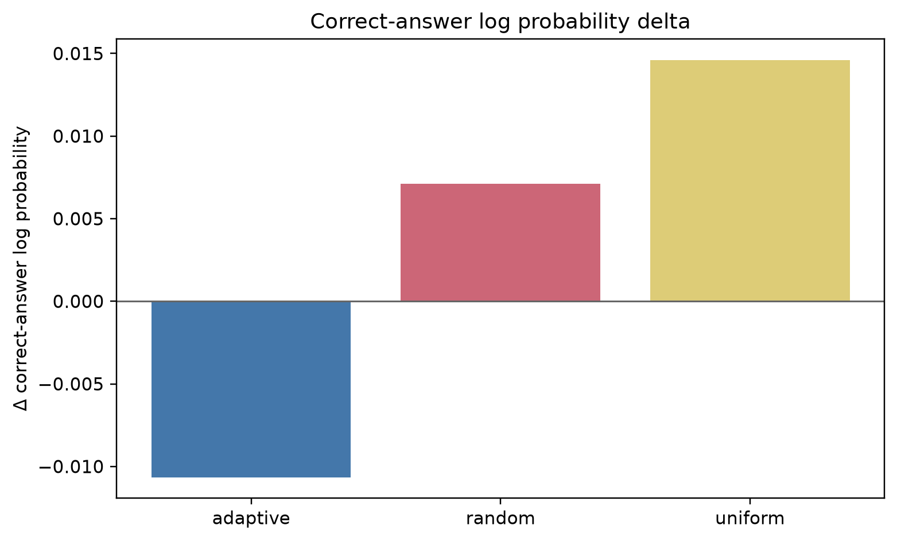
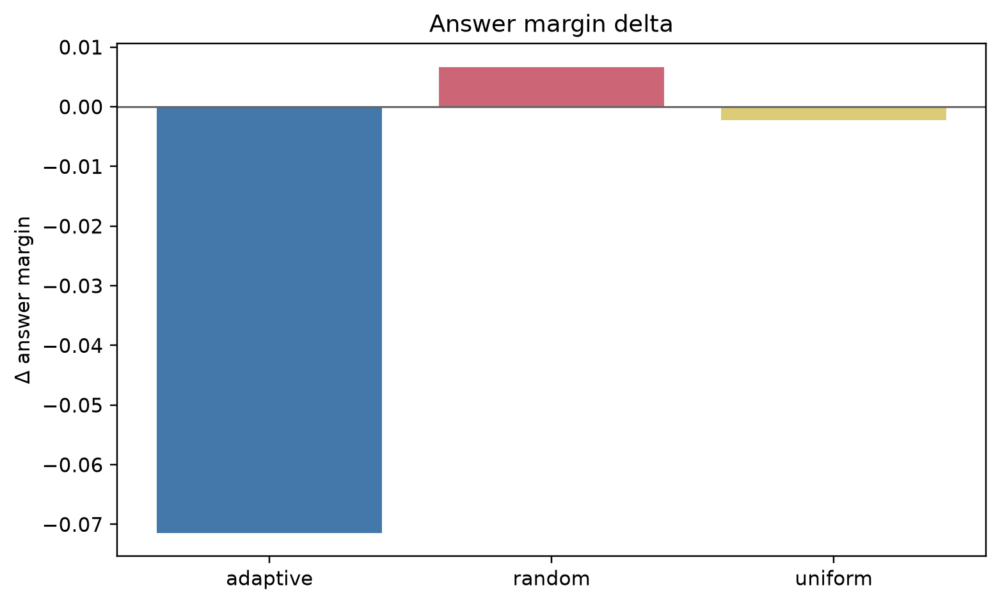
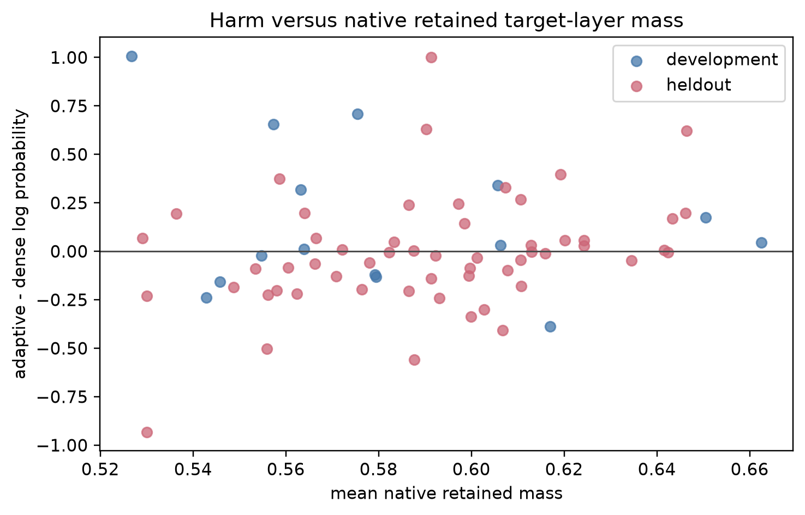
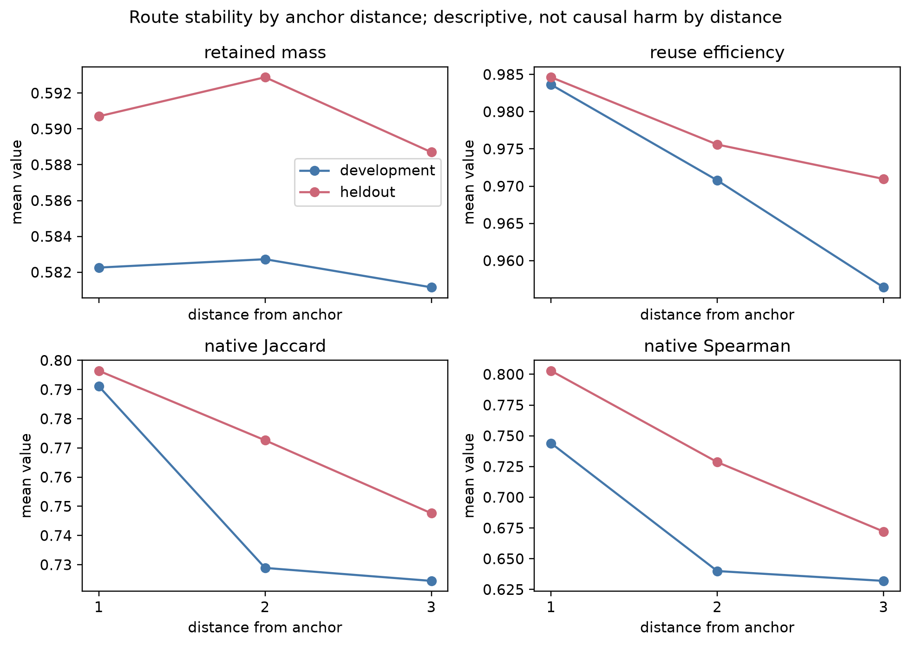

# Experiment 1 Weekly Scientific Report

## Executive Summary

This week measured whether video-VLM decoder attention is temporally non-uniform, whether that temporal allocation is predictable across decoder depth, and whether an attention-ranked temporal route can preserve answer quality under causal masking.

The central empirical result is not a universal first-bin or last-bin rule. It is that decoder temporal attention is non-uniform in both Qwen2.5-VL-7B-Instruct and Llama-3-VILA1.5-8B, while the preferred temporal positions and depth trajectories differ by architecture and sampling protocol. A useful temporal optimization therefore has to adapt to the model's observed temporal allocation rather than assume a fixed positional preference.

Supported findings:

| Finding | Evidence package source |
|---|---|
| Qwen duration-controlled decoder attention is non-uniform. | `outputs/experiment1_v3/preliminary/corrected/corrected_plot_diagnostics.json` |
| VILA fixed-eight decoder attention is non-uniform. | `outputs/experiment1_v3_cross_model/preliminary/vila_baseline/vila_baseline_diagnostics.json` |
| Qwen and VILA do not share the same fixed-eight temporal pattern. | `outputs/experiment1_v3_cross_model/matched_baseline_comparison.json` |
| Hard attention-ranked temporal route replay failed on held-out Qwen examples. | `cross_model_analysis/qwen_route_reuse_heldout/summary.json` |
| Shorter route refresh did not fix the development failure. | `cross_model_analysis/qwen_route_refresh_dev/summary.json` |
| Qwen decoder temporal non-uniformity persisted in a preliminary repeated-frame positional control. | `outputs/experiment1_v3/preliminary/repeated_frame_partial/corrected_plot_diagnostics.json` |

Negative findings are scientifically important. The held-out route-replay gate failed: attention-ranked hard temporal retention did not preserve correct-answer log probability or answer margin better than equal-budget random or uniform controls. The shorter-refresh development pilot was rejected because gap 2 did not improve over gap 4. These results reject hard temporal eviction based only on attention rank. They do not reject temporal structure, temporal predictability, or temporal optimization generally.

No actual KV-cache reuse, temporal token compression, optimized sparse kernel, latency reduction, memory reduction, or measured FLOP reduction has been demonstrated. The next viable hypothesis is temporal information handoff: compress a temporal region into compact evolving memory after it has received concentrated processing, rather than continuing to expose all original visual tokens to every later decoder layer.

## Research Question

Do video-language-model decoders allocate question-to-visual attention non-uniformly over time, is that allocation predictable across decoder depth, and can this structure support a causal temporal compute optimization without materially degrading answer quality?

This breaks into three subquestions:

| Subquestion | Operational test |
|---|---|
| Characterization | Is temporal visual attention non-uniform across decoder layers? |
| Generality | Does non-uniformity occur in more than one decoder architecture, even when the exact positional pattern differs? |
| Optimization | Can temporal structure reduce later-layer computation while preserving task performance? |

The report separates descriptive observations, cross-model evidence, predictive analyses, causal interventions, negative findings, proposed but untested hypotheses, and actual measured system improvements. Observational attention is not treated as causal importance.

## Experimental Cohorts and Protocols

### Qwen Duration-Controlled Baseline

The duration-controlled Qwen study used Qwen2.5-VL-7B-Instruct on HD-EPIC VQA single-video examples. The frozen primary manifest contains 77 source videos and 77 primary questions from four categories. The run used medium resolution, adaptive full-coverage temporal sampling, 8-64 temporal bins per example, two chronological frames per temporal bin, up to 128 total frames, all 28 decoder layers, and question-token-to-visual-token decoder attention. The encoder analyses measured all 32 vision blocks and representation stages where available.

Packaged manifest composition:

| Field | Counts |
|---|---|
| Examples | 77 |
| Unique source videos | 77 |
| Participants | 9 |
| Categories | fine_grained 39; gaze 13; ingredient 13; object_motion 12 |
| Duration groups | short 26; medium 25; long 26 |
| Splits | dev 17; test 60 |
| Question types | fine_grained_action_localization 13; fine_grained_action_recognition 25; fine_grained_why_recognition 1; gaze_interaction_anticipation 13; ingredient_ingredient_adding_localization 8; ingredient_ingredient_weight 5; object_motion_object_movement_itinerary 12 |

The category-duration table is imbalanced:

| Duration group | fine_grained | gaze | ingredient | object_motion | Total |
|---|---:|---:|---:|---:|---:|
| short | 26 | 0 | 0 | 0 | 26 |
| medium | 5 | 13 | 5 | 2 | 25 |
| long | 8 | 0 | 8 | 10 | 26 |

This confounding means duration-stratified accuracy and attention cannot be interpreted as pure duration effects.

### Matched Cross-Model Cohort

The cross-model study used Qwen2.5-VL-7B-Instruct and `Efficient-Large-Model/Llama-3-VILA1.5-8B`. It used 71 matched source videos with the same eight uniformly positioned frames for both models, eight normalized analysis bins, model-native decoder layer counts, and normalized decoder depth for comparison. It measured conditional temporal attention and absolute question-to-visual attention mass.

Six examples from the 77-example set were excluded as sampling-ineligible, not as model failures. Their annotated clips were too short under the frozen cross-model center-frame rule to yield eight distinct decodable frame indices, so the sampler rejected them rather than duplicating frames:

| Excluded question ID |
|---|
| fine_grained_action_recognition_1920 |
| fine_grained_action_recognition_1999 |
| fine_grained_action_recognition_3123 |
| fine_grained_action_recognition_3824 |
| fine_grained_action_recognition_7084 |
| fine_grained_why_recognition_235 |

All cross-model accuracy and attention denominators are therefore 71, not 77.

### Development and Held-Out Cohorts

The route-replay work used the fixed-eight cross-model eligible cohort. Development and held-out examples were kept separate.

| Cohort | Examples | Participants | Categories | Duration groups |
|---|---:|---:|---|---|
| Development | 15 | 7 | fine_grained 6; gaze 3; ingredient 3; object_motion 3 | short 3; medium 6; long 6 |
| Held-out | 56 | 9 | fine_grained 27; gaze 10; ingredient 10; object_motion 9 | short 17; medium 19; long 20 |

Development examples were used for route-pilot design and kill tests. Held-out examples were used for the frozen confirmatory temporal route-replay evaluation. These results must not be pooled as confirmatory evidence.

### Protocol Distinction

The 77-example Qwen baseline used adaptive 8-64 bins and up to 128 frames. The 71-example matched Qwen-VILA study used exactly eight frames and eight normalized bins. The fixed-eight protocol supports controlled cross-model comparison but can undersample long videos.

## Qwen Duration-Controlled Baseline

The packaged Qwen baseline has 77 complete records from 77 unique source videos. Accuracy was 37/77 = 48.05%.

| Category | Correct | Total | Accuracy |
|---|---:|---:|---:|
| fine_grained | 24 | 39 | 61.54% |
| gaze | 5 | 13 | 38.46% |
| ingredient | 6 | 13 | 46.15% |
| object_motion | 2 | 12 | 16.67% |
| Overall | 37 | 77 | 48.05% |

| Duration group | Correct | Total | Accuracy |
|---|---:|---:|---:|
| short | 19 | 26 | 73.08% |
| medium | 9 | 25 | 36.00% |
| long | 9 | 26 | 34.62% |

The temporal-bin distribution was 39 examples with 8 bins, one with 10 bins, one with 14 bins, one with 16 bins, one with 50 bins, and 34 with 64 bins. The corrected diagnostics report min/median/max bins of 8/8/64.

Encoder attention was uniform in aggregate. The maximum absolute deviation of mean encoder incoming temporal-attention lift from uniform was `9.966250384962905e-07`. This does not imply the encoder lacks temporal information: encoder representations showed positive adjacent-minus-far similarity advantages at all captured stages.

| Encoder stage | Raw adjacent-minus-far mean [95% CI] | Mean-centered adjacent-minus-far mean [95% CI] |
|---|---:|---:|
| vision_block_early | 0.0020579191 [0.0012091015, 0.0030558856] | 0.3266479879 [0.2481439923, 0.4289414025] |
| vision_block_middle | 0.0148136981 [0.0113798425, 0.0188496912] | 0.4779377227 [0.4195913313, 0.5518034504] |
| vision_block_late | 0.0000143508 [0.0000112190, 0.0000176654] | 0.3692273866 [0.2346836471, 0.5116496752] |
| vision_merger_pre_reverse | 0.0262579784 [0.0202227321, 0.0322450753] | 0.4429722759 [0.3990618422, 0.4973931875] |
| vision_final | 0.0262579784 [0.0202159832, 0.0324300517] | 0.4429722759 [0.3970904742, 0.4905326302] |

Decoder temporal attention was non-uniform. The maximum mean decoder lift-minus-uniform deviation was `1.3266424824273937`, corresponding to a maximum averaged lift of 2.3266424824273937 times uniform. The existing corrected Qwen report describes a broad early emphasis in early decoder layers and increasing late-video emphasis through middle and later layers.

Layer-14 redistribution is visible in the packaged diagnostics:

| Question type | n | Layer 13 entropy | Layer 14 entropy | Layer 15 entropy |
|---|---:|---:|---:|---:|
| fine_grained_action_localization | 13 | 0.8583106361 | 0.9473276281 | 0.8913602061 |
| fine_grained_action_recognition | 25 | 0.9810628790 | 0.9476834836 | 0.9979293782 |

Figure 1. Encoder temporal attention relative to uniform. Cohort: 77 Qwen adaptive-duration examples. Quantity: lift-minus-uniform incoming temporal attention. Interpretation: aggregate encoder attention is effectively uniform. Status: descriptive.

Figure 2. Decoder temporal attention relative to uniform. Cohort: 77 Qwen adaptive-duration examples. Quantity: decoder question-to-visual temporal lift-minus-uniform. Interpretation: decoder allocation is temporally non-uniform and layer-dependent. Status: descriptive.

Figure 3. Decoder temporal entropy by question type. Cohort: 77 Qwen adaptive-duration examples. Quantity: normalized temporal entropy across decoder layers. Interpretation: concentration changes non-monotonically and differs by question type. Status: descriptive.

Figure 4. Decoder absolute visual-attention mass. Cohort: 77 Qwen adaptive-duration examples. Quantity: absolute question-to-visual attention mass, not normalized over temporal bins. Interpretation: total visual access and conditional temporal allocation are distinct. Status: descriptive.

Figure 5. Encoder local temporal advantage. Cohort: 77 Qwen adaptive-duration examples. Quantity: adjacent-minus-far representation similarity. Interpretation: encoder representations retain local temporal structure even though aggregate attention is uniform. Status: descriptive.

### Preliminary Repeated-Frame Positional Control

The preliminary repeated-frame control preserved sequence length and temporal positions while replacing every sampled frame with the same visual frame. This removes temporal content variation while preserving positional structure. It therefore tests whether temporal non-uniformity can persist without changing visual content.

The frozen plotting diagnostics contain 12 source-video artifacts with an 8-64 temporal-bin range. The archived repeated-frame records file contains nine complete unique records. Because of that inventory discrepancy, this report treats the 12-artifact diagnostics as a frozen preliminary aggregate, does not reconstruct per-example results, does not report repeated-frame accuracy, and does not report paired baseline differences.

Packaged repeated-frame diagnostics:

| Measurement | Value |
|---|---:|
| Frozen diagnostic artifacts | 12 |
| Archived complete records | 9 |
| Temporal-bin range | 8-64 |
| Maximum absolute encoder lift deviation from uniform | 2.6838581579369247e-08 |
| Maximum absolute decoder lift deviation from uniform | 2.7386054371816946 |

Encoder adjacent-minus-far representation differences were effectively zero in both raw and mean-centered representations. Raw stage means ranged from `1.850371707708594e-17` to `4.625929269271486e-17`; mean-centered stage means ranged from `0.0` to `6.47630097698008e-17`.

The decoder result is substantial: temporal non-uniformity remains even when visual content is repeated across temporal positions. This is consistent with a positional or architectural contribution to decoder temporal non-uniformity. It shows that non-uniform allocation can persist without changing visual content. It does not quantify how much of the real-video pattern is positional, and it is preliminary rather than confirmatory.

## Matched Qwen-VILA Temporal Comparison

The matched baseline comparison contains 71 common examples. Qwen and VILA each have 71 completed artifacts in the packaged matched comparison. Qwen has 28 decoder layers; VILA has 32. Both were analyzed over eight normalized temporal bins.

Matched fixed-eight accuracy:

| Model | Correct | Total | Accuracy |
|---|---:|---:|---:|
| Qwen fixed-eight baseline | 26 | 71 | 36.62% |
| VILA fixed-eight baseline | 24 | 71 | 33.80% |

Category accuracy:

| Model | fine_grained | gaze | ingredient | object_motion |
|---|---:|---:|---:|---:|
| Qwen | 18/33 = 54.55% | 1/13 = 7.69% | 4/13 = 30.77% | 3/12 = 25.00% |
| VILA | 12/33 = 36.36% | 2/13 = 15.38% | 7/13 = 53.85% | 3/12 = 25.00% |

Depth-aligned aggregate comparison:

| Metric | Qwen mean [95% CI] | VILA mean [95% CI] |
|---|---:|---:|
| Temporal lift summary | 0.3924300467 [0.3703244377, 0.4145698255] | 1.1392032837 [1.0953685133, 1.1840658384] |
| Normalized entropy | 0.9815215173 [0.9797521692, 0.9832379558] | 0.9464519767 [0.9430996114, 0.9495980758] |
| First-bin mass | 0.1567690506 [0.1512367795, 0.1622549959] | 0.0956337182 [0.0932404945, 0.0980590711] |
| Last-bin mass | 0.1152048117 [0.1103547662, 0.1202147368] | 0.2662680922 [0.2605962439, 0.2720263103] |
| Absolute visual mass | 0.1600041894 [0.1541806166, 0.1659837422] | 0.1263414751 [0.1214929894, 0.1312208294] |

The per-example depth-aligned Qwen-VILA Spearman correlation was -0.1804158283 with 95% CI [-0.2520261450, -0.1083033918], n = 71. This supports the cross-model conclusion that non-uniformity is shared, but the positional pattern is not.

VILA-specific diagnostics show strong final-bin weighting. The maximum mean lift-minus-uniform deviation was `2.6827750241703536`, corresponding to 3.6827750241703536 times uniform. The lowest VILA entropy occurred at layer 0 with normalized entropy 0.8183040955. The strongest last-bin preference also occurred at layer 0, with last-bin mass 0.4603468780 and 95% CI [0.4483689645, 0.4724587881]. Bin 7 was top-ranked for all examples in 14 of 32 layers and for 0.7183098592 of examples even at its weakest layer.

Figure 6. VILA decoder attention lift relative to uniform. Cohort: 71 VILA fixed-eight examples. Quantity: `8 * p(bin) - 1`. Interpretation: VILA is final-bin-dominant throughout the decoder. Status: descriptive.

Figure 7. VILA decoder entropy by question type. Cohort: 71 VILA fixed-eight examples. Quantity: normalized temporal entropy. Interpretation: entropy remains high overall but concentration is non-monotonic. Status: descriptive.

Figure 8. VILA first-bin and last-bin mass. Cohort: 71 VILA fixed-eight examples. Quantity: temporal mass in bins 0 and 7. Interpretation: last-bin mass is systematically above the uniform 0.125 reference. Status: descriptive.

Figure 9. VILA top-bin position. Cohort: 71 VILA fixed-eight examples. Quantity: fraction of examples whose top bin is each temporal position. Interpretation: the last-bin preference is broadly shared across examples. Status: descriptive.

Figure 10. VILA absolute visual-attention mass. Cohort: 71 VILA fixed-eight examples. Quantity: absolute question-to-visual attention mass. Interpretation: total visual access follows a different curve from conditional temporal allocation. Status: descriptive.

Figure 11. VILA accuracy by category. Cohort: 71 VILA fixed-eight examples. Quantity: multiple-choice accuracy. Interpretation: VQA performance differs by category but is descriptive only. Status: descriptive.

The defensible cross-architecture claim is that decoder temporal non-uniformity appears in two distinct decoder architectures. It is not that Qwen and VILA share the same temporal ordering.

## Cross-Layer Temporal Route Predictability

This analysis was executed on the 15-example matched development cohort, but its authoritative numerical outputs were accidentally omitted from the evidence bundle. The missing files are `route_reuse_summary.json` and `route_reuse_metrics.jsonl`. I therefore do not reconstruct or report numerical values for captured mass, oracle mass, reuse efficiency, Jaccard, Spearman, subgroup results, or confidence intervals.

The executed analysis compared dynamic source-layer top-k routes at layer gaps 1, 2, 4, and 8. It also compared a leave-one-participant-out static development prior. Both Qwen and VILA were covered. The qualitative project finding was that nearby-layer temporal allocation was predictable; VILA appeared more stable across depth; and Qwen predictability degraded more strongly with layer distance.

This is an executed but not archived exploratory result. It remains observational. It does not prove causal safety, KV reuse, pruning safety, latency reduction, or memory reduction.

| Analysis component | Archival status | Reporting decision |
|---|---|
| Dynamic routes at gaps 1/2/4/8 | Executed; numerical artifact not archived | Qualitative result only |
| Static development prior | Executed; numerical artifact not archived | Qualitative result only |
| Captured and oracle mass | Artifact not archived | Omit values |
| Reuse efficiency | Artifact not archived | Omit values |
| Jaccard, Spearman and confidence intervals | Artifact not archived | Omit values |

## Causal Temporal Route-Replay Evaluation

The route-replay intervention selected model-native Qwen temporal routing units, retained 50% of units, replayed a gap-4 route derived from dense baseline artifacts, and masked direct text/query access to omitted visual-token keys at later decoder layers. It compared attention-ranked adaptive selection against equal-budget random and uniform controls.

What was not done: no K/V tensors were reused, no earlier attention outputs were substituted, no temporal summary tokens were created, no tokens were physically removed, sequence length was not reduced, no sparse attention kernel was used, and no measured latency, FLOP, or memory reduction was reported. This was hard temporal route replay, not KV-cache reuse.

Development cohort results were exploratory:

| Condition | n | Dense acc. | Routed acc. | Flip rate | Mean log-prob delta [95% CI] | Median log-prob delta | Mean margin delta [95% CI] | Median margin delta |
|---|---:|---:|---:|---:|---:|---:|---:|---:|
| adaptive | 15 | 20.00% | 26.67% | 6.67% | 0.1487022336 [-0.0366727775, 0.4299057136] | 0.0300311178 | 0.2916666667 [0.0178571429, 0.6979166667] | 0.0000000000 |
| random | 15 | 20.00% | 20.00% | 13.33% | -0.0917750806 [-0.3817061828, 0.2182827928] | 0.0051921662 | -0.0333333333 [-0.3269531250, 0.3303571429] | 0.0000000000 |
| uniform | 15 | 20.00% | 20.00% | 20.00% | 0.0823627620 [-0.1980065800, 0.3084348869] | 0.1751374241 | 0.2333333333 [-0.0576923077, 0.5312500000] | 0.2500000000 |

Development paired comparisons:

| Comparison | Mean log-prob difference [95% CI] | Mean margin difference [95% CI] |
|---|---:|---:|
| adaptive - random | 0.2404773142 [0.0148091452, 0.6067440323] | 0.3250000000 [0.0723684211, 0.7403846154] |
| adaptive - uniform | 0.0663394716 [-0.1106406741, 0.3699492627] | 0.0583333333 [-0.1607142857, 0.3854166667] |

Development gate decision: INCONCLUSIVE. Adaptive exceeded random on the packaged point estimates and intervals, but did not clearly outperform uniform.

Held-out cohort results are the confirmatory causal result:

| Condition | n | Dense acc. | Routed acc. | Flip rate | Mean log-prob delta [95% CI] | Median log-prob delta | Mean margin delta [95% CI] | Median margin delta |
|---|---:|---:|---:|---:|---:|---:|---:|---:|
| adaptive | 56 | 41.07% | 32.14% | 23.21% | -0.0106590140 [-0.1185042111, 0.0885685316] | -0.0163594294 | -0.0714285714 [-0.2291772959, 0.0625000000] | -0.1250000000 |
| random | 56 | 41.07% | 37.50% | 21.43% | 0.0071170552 [-0.1094489809, 0.1230094956] | -0.0069012705 | 0.0066964286 [-0.1931871784, 0.1886792453] | 0.0000000000 |
| uniform | 56 | 41.07% | 33.93% | 25.00% | 0.0146123599 [-0.1004901623, 0.1585411173] | -0.0083780917 | -0.0022321429 [-0.1612903226, 0.2211647727] | -0.0625000000 |

Held-out paired comparisons:

| Comparison | Mean log-prob difference [95% CI] | Mean margin difference [95% CI] |
|---|---:|---:|
| adaptive - random | -0.0177760692 [-0.1858952155, 0.1424264161] | -0.0781250000 [-0.3110481266, 0.1545508658] |
| adaptive - uniform | -0.0252713739 [-0.1975323403, 0.0730885808] | -0.0691964286 [-0.3653846154, 0.0821540179] |

Held-out gate decision: FAIL. Attention-ranked hard retention did not preserve answer quality better than equal-budget random or uniform controls. The rejected claim is the hard-retention rule, not temporal structure itself.

Figure 12. Held-out route-replay quality delta. Cohort: 56 held-out Qwen fixed-eight examples. Quantity: correct-choice log-probability deltas. Interpretation: adaptive hard route replay did not beat equal-budget controls. Status: causal intervention.

Figure 13. Held-out route-replay margin delta. Cohort: 56 held-out Qwen fixed-eight examples. Quantity: answer-margin deltas. Interpretation: adaptive route replay did not improve margins relative to controls. Status: causal intervention.

## Route-Replay Failure-Mode Analysis

The CPU-only failure-mode analysis is post-hoc and exploratory. It keeps development and held-out cohorts separate and treats layers as repeated measurements, not independent samples.

Development outcome summary:

| Metric | Mean [95% CI] | n |
|---|---:|---:|
| adaptive - dense log probability | 0.1487022336 [-0.0366727775, 0.4299057136] | 15 |
| adaptive - dense answer margin | 0.2916666667 [0.0250000000, 0.7019230769] | 15 |
| adaptive - random log probability | 0.2404773142 [0.0145841859, 0.6046979442] | 15 |
| adaptive - uniform log probability | 0.0663394716 [-0.1136466188, 0.3778501996] | 15 |

Held-out outcome summary:

| Metric | Mean [95% CI] | n |
|---|---:|---:|
| adaptive - dense log probability | -0.0106590140 [-0.1137812442, 0.0878482898] | 56 |
| adaptive - dense answer margin | -0.0714285714 [-0.2309821062, 0.0654761905] | 56 |
| adaptive - random log probability | -0.0177760692 [-0.1867032138, 0.1370516436] | 56 |
| adaptive - uniform log probability | -0.0252713739 [-0.1933883560, 0.0721132611] | 56 |

Selected held-out exploratory associations with adaptive-minus-dense log probability:

| Hypothesis variable | Spearman [95% CI] | Median split high-low [95% CI] | Interpretation |
|---|---:|---:|---|
| Anchor entropy | -0.2901572112 [-0.5040484613, -0.0399729526] | -0.1620046535 [-0.3042619063, 0.0109837033] | Higher entropy was associated with more harm, but split CI included zero. |
| Retained target-layer mass | 0.3136705400 [0.0246682405, 0.5543089459] | 0.0641895348 [-0.0775113901, 0.2452577370] | Higher retained mass was associated with better outcomes, but split CI included zero. |
| Adjacent selections | 0.0145367751 [-0.2845715349, 0.3287637980] | -0.0250577506 [-0.2727406931, 0.1479464977] | No clear association. |
| Temporal coverage | 0.0110487951 [-0.2934832363, 0.3064913978] | 0.0011187054 [-0.1750226455, 0.1717144768] | No clear association. |
| Route agreement | 0.3290377761 [0.1384493991, 0.5047100334] | 0.2034080986 [0.0593709496, 0.3004709090] | Higher route agreement was associated with better log-probability outcomes. |

The packaged recommendation field is `shorter/dynamic refresh`, but the later shorter-refresh development test rejected the tested shorter-refresh variant. Thus route agreement suggested a route-staleness hypothesis, but the causal refresh pilot did not support it.

Figure 14. Harm versus retained mass. Cohort: 15 development and 56 held-out Qwen route-replay examples. Quantity: exploratory association between retained target-layer mass and answer-quality change. Interpretation: association is diagnostic, not causal. Status: exploratory.

Figure 15. Route stability by anchor distance. Cohort: 15 development and 56 held-out Qwen route-replay examples. Quantity: retained mass, reuse efficiency, native-unit Jaccard, and Spearman by distance. Interpretation: measures route staleness, not causal harm by distance. Status: exploratory.

## Shorter-Refresh Evaluation

The development-only refresh pilot compared gap 2, gap 3, and the existing gap 4. It used the same retention ratio, model, prompts, scoring, and fixed-eight development cohort.

| Condition | n | Mean log-prob delta [95% CI] | Mean margin delta [95% CI] | Routed accuracy | Flip rate | Theoretical q-to-v edge savings |
|---|---:|---:|---:|---:|---:|---:|
| gap2 | 15 | 0.0726283409 [-0.0188447465, 0.2202236221] | 0.1500000000 [0.0125000000, 0.3750000000] | 26.67% | 6.67% | 17.86% |
| gap3 | 15 | 0.0561562452 [-0.0799961784, 0.2041142071] | 0.1166666667 [-0.0661764706, 0.3416666667] | 26.67% | 6.67% | 23.21% |
| gap4 | 15 | 0.1487022336 [-0.0353499548, 0.4248489203] | 0.2916666667 [0.0234197443, 0.7045454545] | 26.67% | 6.67% | 26.79% |

Paired refresh comparisons:

| Comparison | Mean log-prob difference [95% CI] | Mean margin difference [95% CI] |
|---|---:|---:|
| gap2 - gap4 | -0.0760738927 [-0.2628593138, 0.0525087216] | -0.1416666667 [-0.4166666667, 0.0416666667] |
| gap3 - gap4 | -0.0925459883 [-0.3261579264, 0.0557558390] | -0.1750000000 [-0.4886363636, 0.0197642544] |
| gap2 - gap3 | 0.0164720957 [-0.0661752731, 0.1500795062] | 0.0333333333 [-0.0735294118, 0.1785714286] |

Development gate decision: REJECT. The preregistered ordering gap2 > gap3 > gap4 was not observed; gap4 had the largest mean log-probability delta. This does not generalize beyond the tested intervention and cohort, but it rejects route staleness as a sufficient explanation for the held-out failure.

## Spatial Detour

Spatial routing is outside the locked temporal scope, but the evidence package includes a 15-example development spatial pilot. Spatial instrumentation was implemented and validated; the report source states that dense spatial attention was normalized correctly and that temporal outputs were reconstructed without changing the prior temporal outputs. The exact maximum temporal reconstruction difference was not available in the packaged spatial summary.

Spatial development results:

| Condition | n | Mean log-prob delta [95% CI] | Mean margin delta [95% CI] | Routed accuracy | Flip rate |
|---|---:|---:|---:|---:|---:|
| adaptive | 15 | 0.0287022015 [-0.0206905960, 0.1049651674] | 0.0583333333 [-0.0178571429, 0.1666666667] | 20.00% | 13.33% |
| random | 15 | 0.0011777253 [-0.1004807821, 0.1015868077] | 0.0416666667 [-0.0982142857, 0.1875000000] | 13.33% | 6.67% |
| uniform | 15 | 0.0417032232 [-0.0872602517, 0.2004158634] | 0.1000000000 [-0.0703125000, 0.3035993304] | 20.00% | 13.33% |

Paired adaptive-minus-control results:

| Comparison | Mean log-prob difference [95% CI] | Mean margin difference [95% CI] |
|---|---:|---:|
| adaptive - random | 0.0275244762 [-0.0866207217, 0.1484473502] | 0.0166666667 [-0.1500000000, 0.2250000000] |
| adaptive - uniform | -0.0130010217 [-0.1451788996, 0.1109860417] | -0.0416666667 [-0.1875000000, 0.1136600379] |

Spatial gate decision: REJECT. No held-out spatial experiment was run. These results are included for completeness and are not part of the central temporal paper claim.

## Claims Supported and Rejected

| Claim | Status | Evidence | Scope/qualification |
|---|---|---|---|
| Qwen decoder temporal attention is non-uniform. | Supported | 77-example corrected Qwen diagnostics; max decoder lift-minus-uniform deviation 1.3266424824. | Descriptive attention finding. |
| VILA decoder temporal attention is non-uniform. | Supported | 71-example VILA diagnostics; max lift-minus-uniform deviation 2.6827750242. | Descriptive attention finding. |
| Qwen and VILA share the same positional attention pattern. | Rejected | Matched comparison: mean Spearman -0.1804158283; Qwen first-bin mass exceeds last-bin mass, VILA last-bin mass dominates. | Fixed-eight comparison only. |
| Non-uniformity is observed across two decoder architectures. | Supported | Qwen and VILA baseline diagnostics. | Does not imply all VLMs behave this way. |
| Nearby-layer temporal allocation is predictable. | Exploratory | Analysis executed, but numerical output was not archived. | Qualitative project finding only; numerical verification pending archival. |
| Temporal allocation remains equally predictable over large layer gaps. | Not supported | Executed exploratory analysis indicated degradation with layer distance, but the numerical artifact is not archived. | Qualitative project finding only; omit values. |
| A static positional prior is sufficient for all examples. | Not supported | Static-prior sufficiency was never established causally, and its numerical output is not archived. | Qualitative project finding only; omit values. |
| High-attention temporal units can safely be hard-retained. | Rejected | Held-out route-replay causal gate FAIL. | Rejected for tested 50% hard route replay. |
| Attention-ranked retention outperforms random retention on held-out data. | Rejected | Adaptive - random held-out log-prob mean -0.0177760692; margin mean -0.078125. | Tested on 56 held-out examples. |
| Attention-ranked retention outperforms uniform retention on held-out data. | Rejected | Adaptive - uniform held-out log-prob mean -0.0252713739; margin mean -0.0691964286. | Tested on 56 held-out examples. |
| Shorter route refresh fixes the route-replay failure. | Rejected | Development refresh gate REJECT; gap2 - gap4 log-prob mean -0.0760738927. | Development kill test only. |
| Actual KV-cache reuse has been tested. | Not yet tested | No packaged artifact reports KV reuse. | Route replay was masking, not KV reuse. |
| Actual temporal token compression has been tested. | Not yet tested | No summary-token or token-removal artifact. | Proposed only. |
| Actual latency reduction has been demonstrated. | Not yet tested | Runtime is instrumentation runtime only. | No optimized kernel benchmark. |
| Actual memory reduction has been demonstrated. | Not yet tested | No memory reduction analysis artifact. | Not measured. |
| Actual FLOP reduction has been demonstrated. | Not yet tested | Only theoretical edge savings in refresh summary. | No measured FLOP reduction. |
| Temporal information handoff remains a viable hypothesis. | Exploratory | Hard retention failed, but temporal non-uniformity and representation structure remain. | Requires CPU opportunity audit and later causal implementation. |

## Temporal Information-Handoff Hypothesis

The new hypothesis is that an earlier decoder layer may process a temporal region strongly, after which later layers no longer need direct access to every original visual token from that region. Later computation may still need the processed information, but it could be carried by a compact evolving memory representation rather than by all original temporal tokens.

This differs from copying layer-5 attention weights into layer 9. Decoder layers have different query, key, value, and output projections; hidden states change across depth; and attention weights are not interchangeable across layers. Directly substituting earlier attention matrices would be mathematically inconsistent.

A viable temporal handoff formulation would:

| Step | Constraint |
|---|---|
| Detect a temporal region that has already received concentrated processing. | Use current and historical attention, not future layers. |
| Wait until current attention decays relative to its historical peak. | Require persistence before handoff. |
| Merge contiguous temporal cells. | Preserve spatial structure by merging across time only. |
| Create compact temporal memory tokens. | The compact memory must continue evolving through later layers. |
| Allow later layers to attend to the summary. | Physically reduce the number of visual tokens participating in later attention. |

This has not been implemented or causally evaluated.

## Next Experiment

The next experiment should be a CPU-only temporal handoff opportunity audit using the 77-example adaptive-duration Qwen baseline, not the fixed-eight cross-model artifacts. The fixed-eight setting has only four Qwen native temporal cells and is too coarse for the intended handoff analysis.

The audit should measure, for every example, temporal bin, and decoder layer:

| Measurement |
|---|
| normalized attention mass |
| uniform-relative lift |
| historical peak attention |
| historical peak layer |
| current-to-peak ratio |
| consecutive low-attention patience |
| current rank |
| top-25% membership |
| future maximum mass |
| future maximum lift |
| future best rank |
| future revival after proposed handoff |

The development-only policy grid should use:

| Hyperparameter | Values |
|---|---|
| Peak lift threshold | 1.25, 1.5, 2.0 |
| Current-to-peak ratio | 0.25, 0.5, 0.75 |
| Patience | 1, 2, 3 layers |
| Earliest handoff layer | 4, 8, 12 |

Once a temporal region is handed off in the simulation, it remains handed off. The opportunity model should merge contiguous handed-off temporal cells into one temporal summary unit, retain the spatial grid, estimate effective temporal-cell count, estimate visual-token reduction, estimate theoretical attention-FLOP reduction, and measure future revival risk. These are opportunity estimates, not measured speedups.

Development selection constraints should be:

| Constraint |
|---|
| revival rate no greater than 10% |
| at least 70% of development examples exhibit a handoff |
| mean effective temporal-cell reduction of at least 20% |
| every duration group has at least one handoff |

If no policy meets these constraints, the result should be `NO_VIABLE_HANDOFF_POLICY`. The next GPU experiment should occur only after this CPU audit freezes a policy.

## Limitations

This evidence comes from one dataset and two decoder architectures. The development cohort has only 15 examples, and the held-out route-replay cohort has 56 examples. The fixed-eight cross-model comparison undersamples long videos. The 77-example Qwen baseline has category-duration confounding: all short examples are fine-grained, all gaze examples are medium, and most long examples are localization, ingredient, or object-motion tasks.

Attention is not equivalent to causal importance. Qwen and VILA have different model-native temporal units, and normalized eight-bin comparison does not make their internal temporal representations identical. Post-hoc failure-mode analyses are exploratory. The route-replay intervention did not shorten the sequence, did not remove tokens, did not implement an optimized kernel, and did not measure system speedups. No actual KV reuse, latency reduction, memory reduction, or FLOP reduction has been demonstrated. Temporal handoff remains hypothetical.

The repeated-frame control is preliminary. Its frozen diagnostics contain 12 artifacts, whereas the archived records file contains nine complete records. The route-predictability analysis was executed, but its numerical output was not included in the evidence package.

## Artifact Index

| Report section | Source artifact | Purpose |
|---|---|---|
| Experimental cohorts | `docs/results/experiment1_weekly_2026-09-18/manifests/qwen_77_primary_manifest.jsonl` | 77-example manifest, category/duration/split counts |
| Development/held-out cohorts | `docs/results/experiment1_weekly_2026-09-18/manifests/dev_eligible_8frame.jsonl` | 15-example development cohort |
| Development/held-out cohorts | `docs/results/experiment1_weekly_2026-09-18/manifests/heldout_eligible_8frame.jsonl` | 56-example held-out cohort |
| Qwen baseline | `docs/results/experiment1_weekly_2026-09-18/outputs/experiment1_v3/runs/baseline/records.jsonl` | 77-example Qwen records |
| Qwen baseline | `docs/results/experiment1_weekly_2026-09-18/outputs/experiment1_v3/preliminary/corrected/corrected_plot_diagnostics.json` | Corrected Qwen attention and representation diagnostics |
| Qwen figures | `docs/assets/experiment1_v3_corrected/` | Existing corrected Qwen diagrams |
| Preliminary repeated-frame control | `docs/results/experiment1_weekly_2026-09-18/outputs/experiment1_v3/preliminary/repeated_frame_partial/corrected_plot_diagnostics.json` | Frozen 12-artifact aggregate diagnostics |
| Repeated-frame inventory | `docs/results/experiment1_weekly_2026-09-18/outputs/experiment1_v3/runs/repeated_frame/records.jsonl` | Nine archived complete records; documents the inventory discrepancy |
| VILA baseline | `docs/results/experiment1_weekly_2026-09-18/outputs/experiment1_v3_cross_model/runs/vila_baseline/records.jsonl` | VILA records and failures |
| VILA diagnostics | `docs/results/experiment1_weekly_2026-09-18/outputs/experiment1_v3_cross_model/preliminary/vila_baseline/vila_baseline_diagnostics.json` | VILA accuracy, validation, layerwise attention |
| VILA figures | `docs/assets/experiment1_v3_vila_baseline/` | Existing VILA diagrams |
| Matched Qwen-VILA comparison | `docs/results/experiment1_weekly_2026-09-18/outputs/experiment1_v3_cross_model/matched_baseline_comparison.json` | 71-example depth-aligned aggregate comparison |
| Route predictability | Analysis executed; numerical artifact not archived | Missing `route_reuse_summary.json` and `route_reuse_metrics.jsonl`; qualitative result only |
| Development route replay | `docs/results/experiment1_weekly_2026-09-18/cross_model_analysis/qwen_route_reuse_dev/summary.json` | 15-example causal route-replay development summary |
| Held-out route replay | `docs/results/experiment1_weekly_2026-09-18/cross_model_analysis/qwen_route_reuse_heldout/summary.json` | 56-example causal route-replay confirmatory summary |
| Route failure modes | `docs/results/experiment1_weekly_2026-09-18/cross_model_analysis/qwen_route_failure_modes/summary.json` | Post-hoc failure-mode summary |
| Shorter refresh | `docs/results/experiment1_weekly_2026-09-18/cross_model_analysis/qwen_route_refresh_dev/summary.json` | Gap 2/3/4 development refresh summary |
| Spatial pilot | `docs/results/experiment1_weekly_2026-09-18/cross_model_analysis/qwen_spatial_route_dev/summary.json` | Spatial development pilot summary |
| Provenance | `docs/results/experiment1_weekly_2026-09-18/PROVENANCE.txt` | Evidence-generation branch, commit, timestamp |

## Reproducibility Record

| Field | Value |
|---|---|
| Branch | experiment1-temporal |
| Current report-generation commit | 58f5c78 (`Add Experiment 1 weekly scientific evidence bundle`) |
| Evidence-generation commit | 459e5999b418f4fc9f743ecfbcb1d35a32d92f7a |
| Evidence package generated UTC | 2026-09-18T03:45:39Z |
| Report-generation date | 2026-09-17 local environment date |
| Git working-tree status before writing | untracked `docs/experiment1_weekly_report.md` from stale pre-pull attempt |
| Unrelated changes present | No tracked modifications; only the report file was untracked |
| Qwen baseline cohort | 77 examples, adaptive 8-64 bins, two frames per bin, medium resolution |
| Matched cross-model cohort | 71 examples, exactly eight frames and eight bins |
| Development route cohort | 15 examples |
| Held-out route cohort | 56 examples |
| Models/checkpoints | Qwen2.5-VL-7B-Instruct; `Efficient-Large-Model/Llama-3-VILA1.5-8B` |
| Bootstrap replicate counts | 10000 for matched comparison, route replay, refresh, and spatial summaries where packaged |
| Random seeds available | matched comparison 20260830; route refresh 20260916; spatial route 20260917 |
| Route retention ratio | 50% model-native Qwen temporal units for temporal route replay |
| Route gap | Gap 4 for confirmatory route replay; gap 2/3/4 for development refresh |
| Analysis-bin definitions | Qwen adaptive baseline: 8-64 temporal bins; cross-model: eight normalized bins |

Validation performed for this report:

| Check | Result |
|---|---|
| Numerical statements tied to packaged artifacts | Completed for reported values |
| Markdown image links exist | Verified locally |
| 77-example and 71-example protocols separated | Yes |
| Development and held-out results not pooled as confirmatory evidence | Yes |
| Six cross-model excluded clips described as sampling-ineligible | Yes |
| Route predictability not described as causal safety | Yes; executed but numerical artifact not archived |
| Route replay not described as KV-cache reuse | Yes |
| Actual latency, memory, and FLOP savings not claimed | Yes |
| Spatial pilot marked outside temporal scope | Yes |
| Temporal handoff marked proposed, not completed | Yes |
| Unavailable metrics marked unavailable | Route-predictability summary and spatial temporal-difference maximum marked unavailable |
